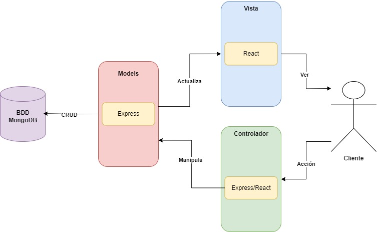
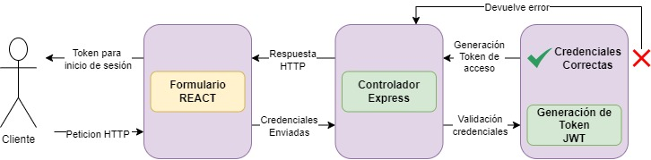

# Proyecto MERN mvc-cidhu 

### link: [](https://www.youtube.com/watch?v=TU_ID_DE_YOUTUBE)


### link: [](https://www.youtube.com/watch?v=TU_ID_DE_YOUTUBE)


## Descripción
El proyecto actual trata acerca de un consorcio de abogados, para primer avance del mini core se presenta el login y registro de los usuarios, estos usuarios están deshabilitados hasta que un usuario administrador cambie el estado de estos mismos, además se presenta el CRUD para agregar, editar y eliminar el usuario.

## Framework MVC
Este proyecto utiliza el patrón de diseño Modelo-Vista-Controlador (MVC) para organizar su código. El MVC es un enfoque de arquitectura de software que separa la aplicación en tres componentes principales:

- **Modelo:** Representa los datos y la lógica de la aplicación. En Express, los modelos pueden ser clases que definen cómo interactuar con la base de datos.

- **Vista:** Es responsable de la presentación y la interfaz de usuario. En React, las vistas son componentes de React que definen cómo se muestran los datos.

- **Controlador:** Maneja las interacciones del usuario y coordina la comunicación entre el modelo y la vista. En Express, los controladores pueden ser funciones que manejan las solicitudes HTTP y actualizan el modelo y la vista según sea necesario.

#Diagrama de la arquitectura del proyecto



#Explicación del diagrama

Primero comenzamos con el cliente realizando una acción en el aplicativo (Controladores), estos se manejan de manera conjunta tanto del lado backend, que es donde se crean estos métodos y se setean las rutas para ser consumidas desde el frontend (en este caso tenemos todos los controladores del CRUD), estos controladores manipulan los modelos definidos en la base de datos (models) estos son creados en la base de datos MongoDB con ayuda de Express y con ayuda de la biblioteca de modelado de objetos para Node.js y mongoDB mongoose. Por último con ayuda del framework REACT mostraremos toda la información al cliente cumpliéndose la estructura MVC con ayuda de las herramientas combinadas MERN (MongoDB, Express, React, Node).


### Sintaxis de MVC en Express con REACT
```javascript
// Modelo (ejemplo usando Mongoose)
const mongoose = require('mongoose');
const Schema = mongoose.Schema;

const miModeloSchema = new Schema({
  // Definición de campos del modelo
});

const MiModelo = mongoose.model('MiModelo', miModeloSchema);

// Controlador (ejemplo)
const miControlador = {
  // Manejo de rutas y lógica de controlador
};

// Vista (React)
// Componentes de React que definen la interfaz de usuario y muestran datos
```

### Explicación del login del proyecto

El proceso de login permite a los usuarios autenticarse en la aplicación. Los usuarios envían sus credenciales a través de un formulario React. En el servidor, el Controlador Express.js valida las credenciales y emite un token de acceso, permitiendo a los usuarios acceder a recursos protegidos.

### Diagrama de la arquitectura del proyecto



### Explicación de la arquitectura del login

-  El proceso es el siguiente
-  El Cliente (Frontend) envía una petición HTTP al servidor.
-  El Controlador (Express.js en el Backend) recibe la solicitud y valida las credenciales del usuario.
-  Si las credenciales son válidas, el Controlador genera un Token de Acceso (JWT), caso contrario devuelve un error como respuesta.
-  El Token de Acceso se devuelve en la respuesta HTTP al Cliente.
-  El Cliente almacena el Token de Acceso y lo utiliza para acceder a Recursos Protegidos en la aplicación.
